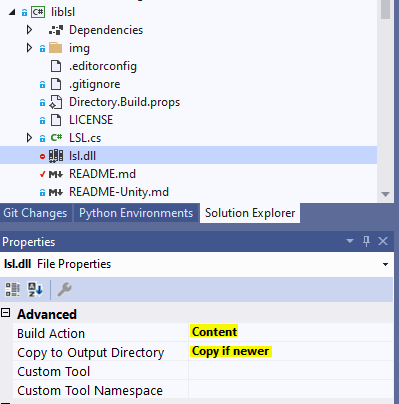

# C# bindings

The is the C# interface to the lab streaming layer. To use it, you need to include the file LSL.cs in your project, and make sure that the appropriate lsl library (e.g. lsl.dll) is findable (e.g., in your application's root directory or in a system path). If LSL.cs fails to find the lsl shared library for your target platform, edit LSL.cs and update the libname line with the library name for your target platform. As of liblsl 1.14, this should be the same for all targets: `const string libname = "lsl";`

## Using Visual Studio 2019

* Make sure you have the .NET desktop development pack installed.*
* Open the liblsl.sln file. If you are asked to upgrade then go ahead.
* Make sure you are using shimmer_dev branch

* Add lsl.dll to your solution.
    * In the solution explorer, right click on the `liblsl` target and choose `Add > Existing Item ...`.
    * In the new explorer window, change the `Add` dropdown button to `Add as Link` and change the file types/extensions to `all files (*.*)`. Browse to where you have lsl.dll, previously downloaded from [releases here](https://github.com/sccn/liblsl/releases), (it can be found in liblsl-1.16.0-Win_amd64.zip file download) and select it.

* Click on the lsl.dll entry now in the solution explorer to view its properties.
* Set "Build Action" to "Content" and "Copy to Output Directory" to "Copy if newer".

From now on, whenever a target in the solution is built, lsl.dll will be copied into the build directory.

# C# Example Programs

The examples folder contains example C# code for sending and receiving data streams. The examples are described in details in the [online documentation](https://labstreaminglayer.readthedocs.io/dev/examples.html#id2).

These example applications can be debugged from within the IDE (i.e. Visual Studio). However, the built products are DLL files, not EXE files. The DLL files can be run at console with `dotnet my_application` (from within same folder as my_application.DLL). This will work anywhere the .NET Core Runtime works. To make a self-contained but platform-dependent product, use `dotnet publish -C Debug -r win10-x64` (or `Release` instead of `Debug`) and this will generate an EXE file.

# Unity

Please see the separate [README-Unity](https://github.com/labstreaminglayer/liblsl-Csharp/blob/master/README-Unity.md).
