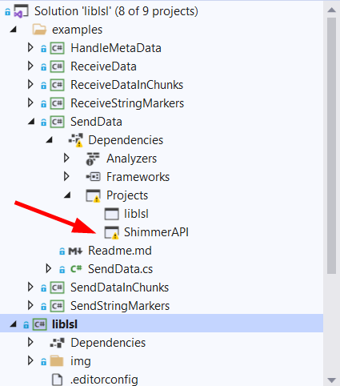
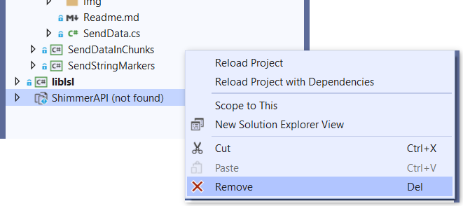
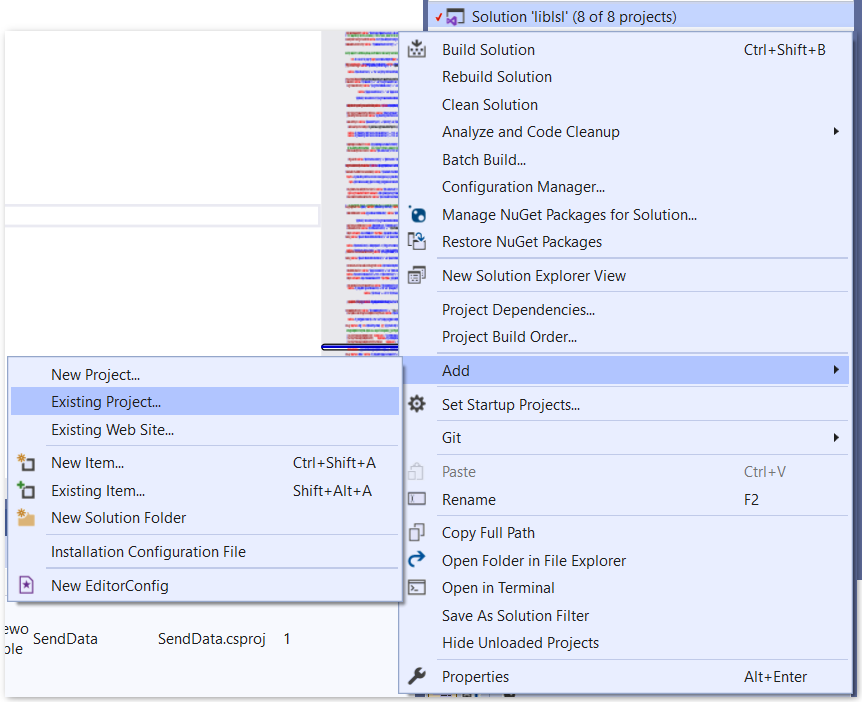
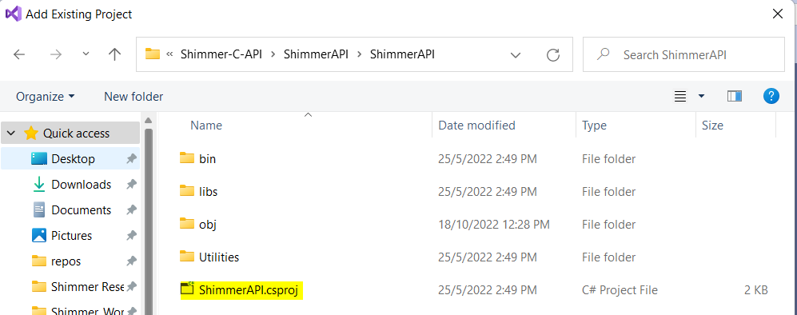

This has been updated just to test the feasibility of using the Shimmer API. Test looks promising, but no validation was done.

Steps to run the example
1. First, follow steps in the readme [here](https://github.com/ShimmerEngineering/liblsl-Csharp/tree/shimmer_dev).
2. If ShimmerAPI project dependency has warning as shown

Clone the project repository from [here](https://github.com/ShimmerEngineering/Shimmer-C-API)

Remove the not found project

Re-add it again by right click Solution 'liblsl' -> Add -> Existing Project as shown

3. Update the btComport (can be find in Bluetooth Settings or using Consensys) accordingly when intializing ShimmerLogAndStreamSystemSerialPort in SendData, for example 

4. Then, make sure sensor Accel is enabled on your shimmer device (it can be configured using Consensys)
5. Run SendData to create a stream outlet and make the streaming data available for other platforms
6. Run it as Release in Visual Studio as shown

OR 

Run the exe through command prompt from within same folder as the dll file as shown

7. Make sure the stream type in both SendData and ReceiveData are the same
8. Run ReceiveData to retrieve the streaming data
